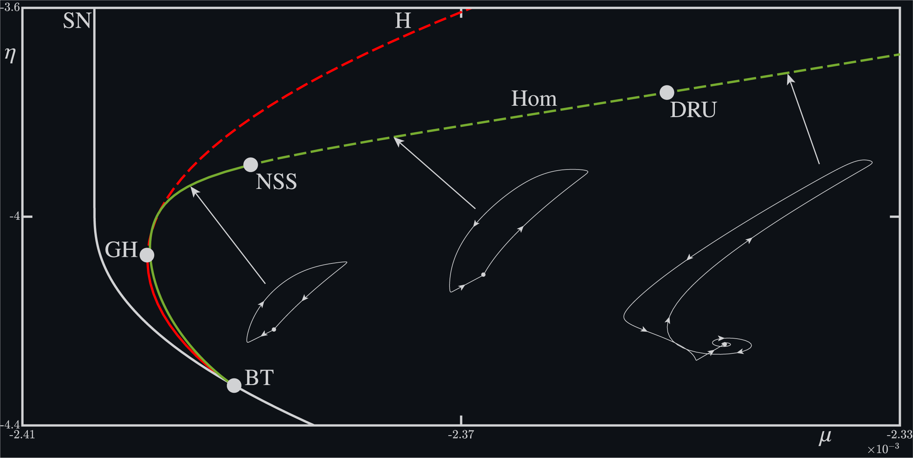

# HomoclinicContinuation_COCO
Homoclinic connections are trajectories $\mathbf u(t)$ in the phase space of a dynamical system that leave a saddle equilibrium $\mathbf u_0$ and eventually return to the same equilibrium as time tends to positive and negative infinity. Such connections are important for understanding the dynamics of a system, as they often organize nearby bifurcations, making their computation a starting point in unraveling the bifurcation diagram. 

<div style="border: 1px solid black; padding: 10px; display: inline-block;">
  
</div>

This repository presents a continuation scheme for the continuation and bifurcation analysis of homoclinic connections in ordinary differential equations, utilizing the COCO Continuation Toolbox in MATLAB and largely following (Kuznetsov, Champneys, 1994). We do not aim to provide a detailed description of each bifurcation, but instead refer the reader to "Elements of Applied Bifurcation Theory" by Yuri Kuznetsov as an entry point to the literature. 

We begin by formulating the boundary value problem (BVP) for path-following a homoclinic trajectory with respect to the parameters $\mu\in\mathbb{R}^2$, along with a description of detected codimension-two bifurcations. We then demonstrate the BVP with a four dimension climate model, identifying a codimension-two Belyakov point and a codimension-two resonance point with real eignvalues. 

## The boundary value problem
We consider differential equations equation of the form

$$\frac{d\mathbf u}{dt} = f(\mathbf u(t),\mu),$$

with state variables $\mathbf u \in \mathbb{R}^n$ and bifurcation parameters $\mu \in \mathbb{R}^2$. A homoclinic orbit with $\mathbf u(t)$ for $t \xrightarrow{} \pm \infty$ may be continued with respect to the parameters $\mu$, and will generically trace out a codimension-one curve in the parameter space. To this end, we implement a boundary value problem (BVP), which employs projection boundary conditions and an integral phase condition, while simultaneously tracking the equilibrium point $\mathbf u_0$. The BVP is given by 

<div style="display: flex; justify-content: center; align-items: center; background-color: white; padding: 15px; border: 1px solid #ddd; border-radius: 5px;">
  
$$f(\mathbf u_0,\mu)=0,$$  

$$\frac{d\mathbf u}{dt} - Tf(\mathbf u, \mu) = 0,$$ 

$$J(\mathbf u_0, \mu) \mathbf v_{u,j} = \lambda_{u,j}\mathbf v_{u,j}, \quad i = 1,\dots, n_u,$$  

$$J(\mathbf u_0, \mu) \mathbf v_{s,i} = \lambda_{s,i}\mathbf v_{s,i}, \quad i = 1, \dots, n_s,$$  

$$\mathbf v^\dagger_{u,i}\mathbf v_{u,j} = 1, \quad j = 1, \dots, n_u,$$  

$$\mathbf v^\dagger_{s,i}\mathbf v_{s,i} = 1, \quad i = 1, \dots, n_s,$$  

$$\int^1_0 \frac{d\tilde{\mathbf u}(t)}{dt} \mathbf u(t) dt = 0,$$  

$$L_s(\mu) \cdot (\mathbf w_s - \mathbf u_0) = 0,$$  

$$L_u(\mu) \cdot (\mathbf w_u - \mathbf u_0) = 0,$$

</div>

where $J$ is the jacobian of $f$, $\mathbf u(t)$ represents the homoclinic solution at the current continuation step, and $\tilde{\mathbf u}(t)$ represents it at the previous step. The endpoints of the homoclinic connection are given by $\mathbf w_{s}$ and $\mathbf w_{u}$, which lie in the stable and unstable linear eignspaces of $\mathbf u_0$, respectively. These eigenspaces are spanned by the eignvectors $\mathbf v_{s,i}$ nad $\mathbf v_{u,j}$. 

The projection operators, $L_s(\mu)$ and $L_u(\mu)$, are reconstructed at each continuation step and vary continuously with the parameters $\mu\in\mathbb R^2.$ More precisely, we solve the linear system

$$U_s(\mu)\left(V(\mu)^T V(\tilde{\mu})\right) = V(\tilde{\mu})V(\tilde{\mu})^T,$$

for $U_s$, where $V(\mu)$ is a matrix whose columns span the orthogonal complement of the unstable (linear) eignspace $E_u^\perp(\mu)$ at the current parameter value $\mu$, and similarly columns of $V(\tilde\mu)$ span the eignspace $E_u^\perp(\tilde\mu)$ at the previous parameter value $\tilde\mu$. We also solve the linear system

$$U_u(\mu)\left(W(\mu)^T W(\tilde{\mu})\right) = W(\tilde{\mu})W(\tilde{\mu})^T,$$

where the columns of $W(\mu)$ and $W(\tilde\mu)$ belong to the span of the orthogonal complement of the stable eigenspaces $E_s^\perp(\mu)$ and $E_s^\perp(\tilde\mu)$, respectively. The desired projection operators are then given by 

$$L_s(\mu) = U_s(\mu)V(\alpha)^T,$$

$$L_u(\mu) = U_u(\mu)W(\alpha)^T.$$

## Codimension-two homoclinic bifurcations
A homoclinic connection can become degenerate at isolated codimension-two points along a homoclinic bifurcation curve, acting as organisation centers for nearby bifurcations. We detect several codimension-two homoclinic bifurcations and also monitor the type of equilibrium involved in the homoclinic connection. The equilibrium type may be printed and has the following labels.

<div align="center">
  
| EQtype | Name                                      |
|:-------:|:-----------------------------------------:|
| 1     | Saddle with real leading eigenvalues                            |
| 2     | Saddle-focus with 2D leading stable manifold                      |
| 3     | Saddle-focus with 2D leading unstable manifold    |
| 4     | Bi-focus with 2D stable and 2D unstable leading manifolds |
  
</div>

The codimension-two homoclinic bifurcations are classified as allows

<div align="center">
  
| Symbol  | Name                                      |
|:-------:|:-----------------------------------------:|
| NSS     | Neutral saddle                            |
| NSF     | Neutral saddle-focus                      |
| DRS     | Double real leading stable eigenvalues    |
| DRU     | Double real leading unstable eigenvalues  |
| TLS     | Three leading stable eigenvalues          |
| TLR     | Three leading unstable eigenvalues        |
| NDS     | Neutrally Divergent Saddle-Focus (Stable) |
| NDU     | Neutrally Divergent Saddle-Focus (Unstable)|
| OFS     | Orbit flip w.r.t stable manifold          |
| OFU     | Orbit flip w.r.t unstable manifold        |
| H       | Shilnikov-Hopf bifurcation                |
| S       | Non-central homoclinic saddle-node bifurcation |
| RES     | Zero of the saddle value                  |

</div>


## Example one: a standard Belnikov transition 
We now demonstrate the boundary value problem (BVP) using a four-dimensional climate model; however, the implementation is applicable to any system. The periodic solutions have already been computed and are stored in the `exampleData` file. Users only need to provide a COCO compatible vector field and ODE function handle within the structural array `probSettings`. For details on the implementation, refer to the function `loadDefaultSettings()`. 

### Code
```markdown
# Load settings
[probSettings, thmEq, thmPO, thmHB, thmSN, thmHom, thmSNPst, thmSNPun, thmPDst] = loadDefaultSettings();

## HOM - part 1
# Settings 
probSettings.corrSettings.TOL = 1e-4;
probSettings.collSettings.NTST = 250;
probSettings.contSettings.PtMX = [850 0];
probSettings.contSettings.h0 = 1e-2;
probSettings.contSettings.h_max = 1e-2;
# Construct COCO homoclinic problem 
prob = proj_isol2hom('PO_example1', 80, probSettings);
# Run COCO
coco(prob, 'Hom_example1_part1', [], 1, {'mu', 'eta', 'EqType', 'x.coll.err', 'x.coll.err_TF'})

## HOM - part 2
# Settings
probSettings.contSettings.PtMX = [0 850];
probSettings.corrSettings.TOL = 1e-6;
probSettings.collSettings.NTST = 500;
probSettings.contSettings.h0 = 1e-1;
probSettings.contSettings.h_max = 2e-1;
# Construct COCO homoclinic problem 
prob = proj_hom2hom('Hom_example1_part1', 1, probSettings);
# Run COCO
coco(prob, 'Hom_example1_part2', [], 1, {'mu', 'eta', 'EqType', 'x.coll.err', 'x.coll.err_TF'})

## Plot Hom
coco_plot_bd(thmHom, 'Hom_example1_part1')
coco_plot_bd(thmHom, 'Hom_example1_part2')
```

### Two-parameter bifurcation diagram
The bifurcation diagram displays a homoclinic bifurcation branch, labeled `Hom`. Also shown are the curves `H` of Hopf bifurcation and `S` of saddle-node bifurcation of equilibria; however, these are not discussed here.

<div style="border: 1px solid black; padding: 10px; display: inline-block;">
  
</div>


# Known bugs and TODO

- Known bugs that I pinky promise to fix:
  - COCOs mesh-adaption has to be turned off (i.e. NAdapt = 0). There seems to be a conflict with updating the phase condition before each continuation step. This would also then fix an issue continuting homoclinic connections which require high NTST values. 
     
- TODO:
  - Computation of the adjoint problem.
  - Following from the adjoint problem, the test functions for inclination flips.
  - Orientability index.
  - Continuation of eigenspaces using the Riccati equation approach as implemented in MATCONT.

# Contact and citation
```

                         _
                       _( )_
                      (_ O _)
                        (_)                            ,-.  _
              _________/_                    _________/_  \( )_
              \       / /                    \       / / (_ O _)
               )=====@=(                      )=====@=(    (_)
          ____/_________\____            ____/_________\____
              | /^\ /^\ |                    | /~\ /~\ |
             _| \0/_\0/ |_                  _| \a/_\a/ |_            
            (_  _ (_) _  _)                (_  _'(_) _  _)
              \( \___/ )/                    \( \___/ )/
               \\\___///                      \\ ,-. //
            ,-._\\___//_,-.                 __ \\___// __
            |* *`-._,-' * |                |* *--._,--'* |
            | * * (_)* * *|                | * * (_)* * *|
            |* _,-' `-.*  |                |* ,-'   `-.* |
            `-'         `-'                `./         \,'
       


```
